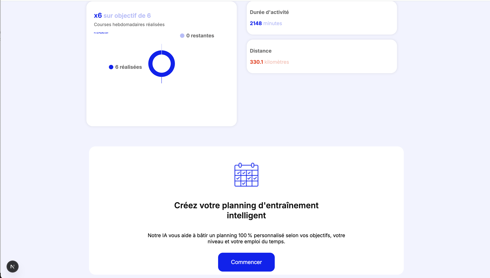

# Projet SportSee – Dashboard Utilisateur avec React et IA

## Description

L’objectif de ce projet est de recréer la page profil d’un utilisateur et d’implémenter une authentification avec React et NextJS. Le projet inclut également un dashboard sportif avec visualisation des données, des fonctionnalités IA et la gestion d’un plan d’entraînement.

---

## Technologies utilisées

- **NextJS** : Framework React utilisé pour sa facilité d’intégration avec une API IA et son routing intégré.
- **React** : Gestion des composants et de l’UI.
- **Context API** : Pour la gestion d’état globale (authentification, données utilisateur, etc.).
- **NodeJS (Backend)** : Fournit l’API avec 3 utilisateurs et leurs mots de passe.
- **Fetch / Axios** : Pour gérer les requêtes HTTP vers le backend.
- **Recharts** : Pour visualiser les statistiques et l’activité sportive.
- **CSS / Tailwind** : Version desktop uniquement (>1024x768 px).
- **Postman** : Pour tester les premières requêtes à l’API.

---

## Fonctionnalités

- Authentification utilisateur avec maintien de session.
- Dashboard avec graphiques Recharts pour l’activité sportive.
- Page profil dynamique affichant les informations utilisateur.
- Plan d’entraînement généré via IA.
- Gestion des étapes de création de plan d’entraînement (Step 1 à Step 3).
- UI responsive pour desktop avec effets visuels et animations sur les boutons.
- Prompts IA pour recommandations personnalisées.

---

## Screenshots

### Page de connexion


### Page profil utilisateur


### Dashboard et graphiques



### Plan d’entraînement généré


---

## Installation

### Backend

1. **Se placer dans le dossier backend**

```bash
cd backend
npm install
npm run build
npm start
``
Frontend

Se placer dans le dossier frontend
cd frontend
npm install
npm run dev
```
